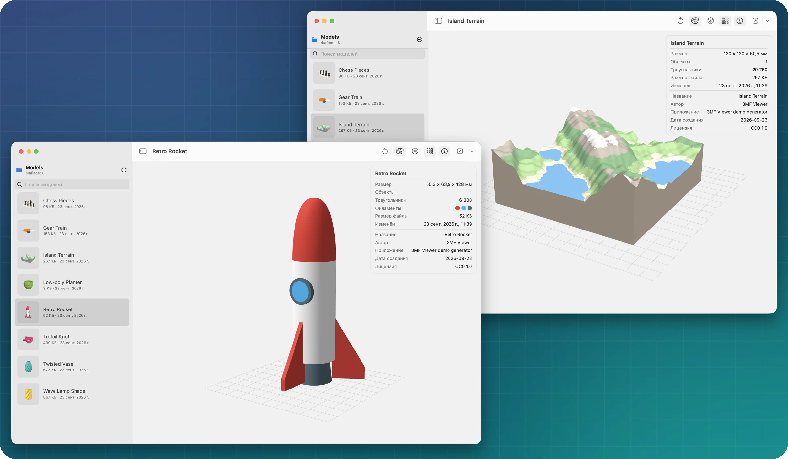
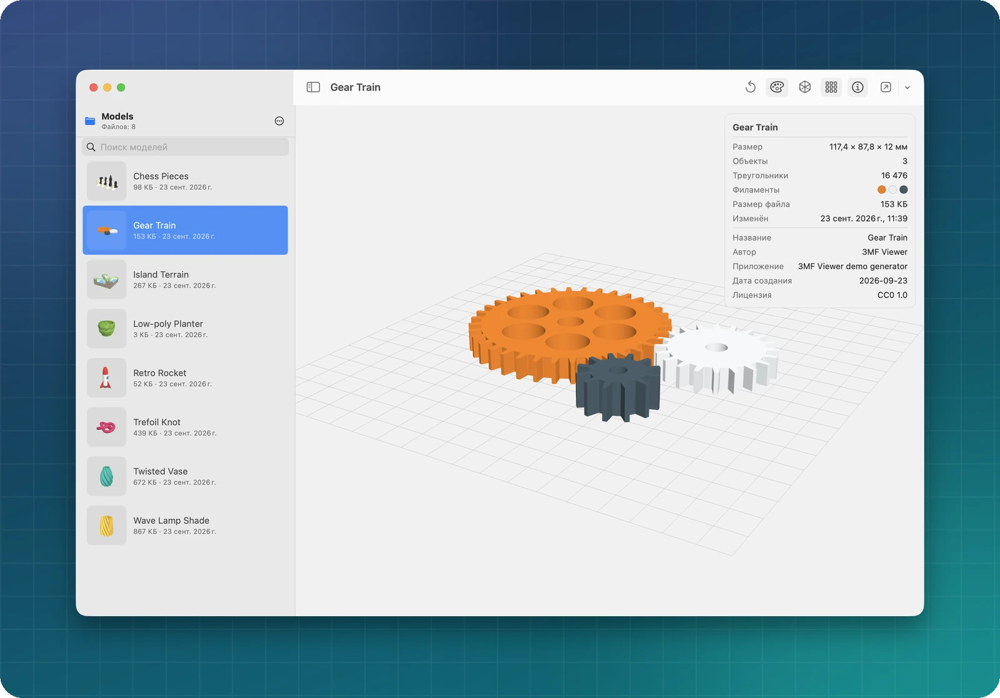
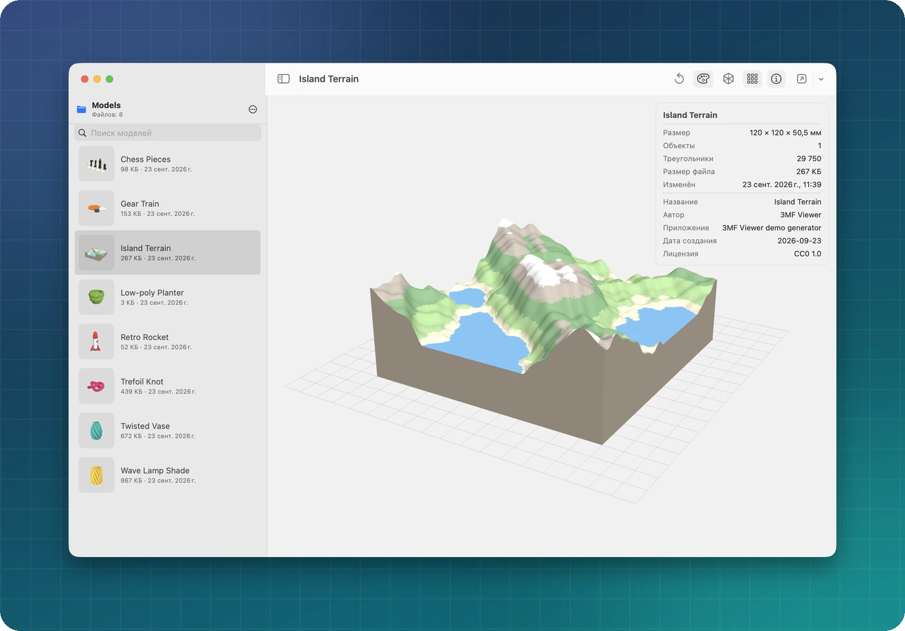
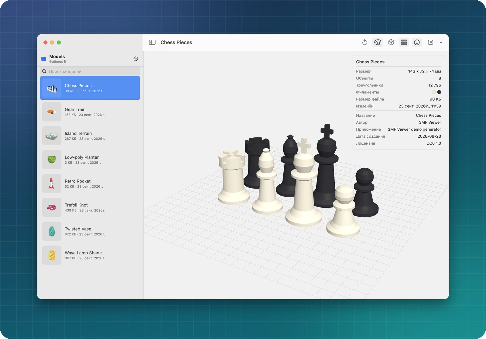
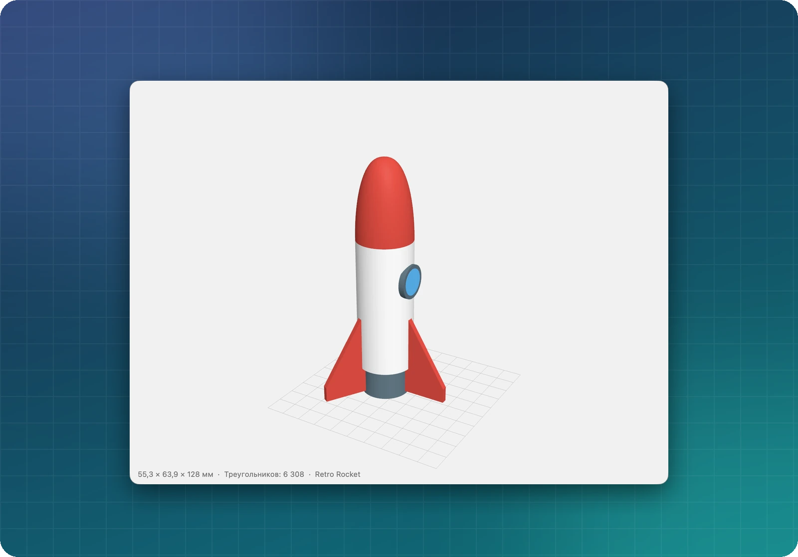
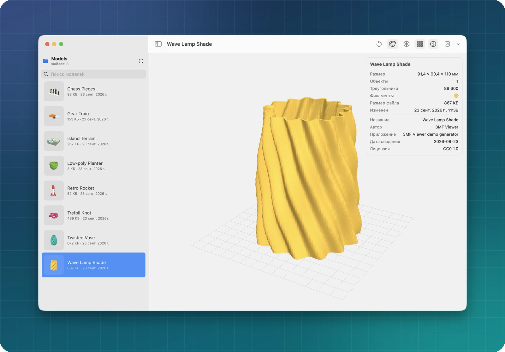
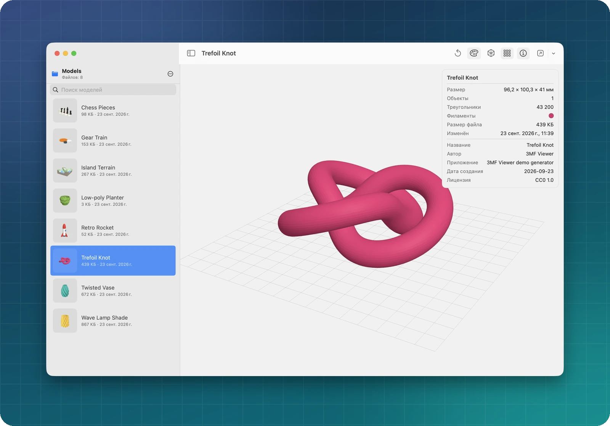

<p align="center">
  
</p>

<h1 align="center">3MF Viewer</h1>

<p align="center">
  <b>Быстрый нативный просмотрщик моделей для 3D-печати в формате <code>.3mf</code> для macOS.</b><br>
  Укажите папку и листайте свои модели: миниатюры, интерактивное 3D-превью,<br>
  настоящие цвета филаментов из Bambu Studio, OrcaSlicer и PrusaSlicer, а также Quick Look прямо в Finder.
</p>

<p align="center">
  <a href="../../releases/latest"></a>
  
  
  
  <a href="LICENSE"></a>
</p>

<p align="center"><a href="README.md">English version</a></p>

<p align="center">
  
</p>

## Зачем

Проекты из слайсера быстро копятся, а в Finder все файлы `.3mf` выглядят одинаково. Открывать каждый в слайсере, только чтобы понять, что внутри, долго. 3MF Viewer показывает всю папку сразу и открывает даже модели из миллионов треугольников за пару секунд.

## Возможности

- **Библиотека из папки.** Выберите папку (или перетащите её в окно или на иконку в Dock). Все `.3mf` из неё появятся списком, при желании вместе с подпапками. Есть поиск и сортировка по имени, дате или размеру. Список обновляется сам, когда файлы добавляются или удаляются.
- **Миниатюры.** Берётся превью, которое Bambu Studio, OrcaSlicer, PrusaSlicer, Cura и другие слайсеры встраивают в файл. Если превью нет, модель рендерится в фоне. Миниатюры кэшируются на диске.
- **Интерактивное 3D-превью** (SceneKit): вращение, зум, панорамирование, сброс вида (⌘0), каркасный режим, сетка стола.
- **Цвета из проекта слайсера**: цвета филаментов Bambu Studio / OrcaSlicer (`project_settings.config`) и PrusaSlicer (`Slic3r_PE.config`), экструдеры для объектов и частей, мультиматериальная покраска (`paint_color`, `mmu_segmentation`), цвета материалов 3MF (`basematerials`, `colorgroup`).
- **Правильная геометрия**: компоненты, production-расширение (объекты в `3D/Objects/*.model`), трансформации, единицы измерения. Модификаторы и отрицательные объёмы скрыты.
- **Информационная панель**: размеры в мм, число объектов и треугольников, филаменты, название, автор, приложение.
- **Quick Look в Finder**: нажмите пробел на файле `.3mf`, и модель можно вращать в 3D прямо в окне Quick Look. Вместо иконок файлов Finder показывает превью моделей.
- **«Открыть в программе»**: модель можно отправить в Bambu Studio, PrusaSlicer, OrcaSlicer или любое другое приложение. Есть «Показать в Finder» и «Скопировать путь».
- Интерфейс на русском и английском. Сторонних зависимостей нет.

## Скриншоты

<table>
  <tr>
    <td width="50%" valign="top">
      
      <p><b>Филаменты из проекта слайсера</b><br>
      Каждый объект получает цвет филамента, назначенный в Bambu Studio или OrcaSlicer. Образцы цветов есть в информационной панели.</p>
    </td>
    <td width="50%" valign="top">
      
      <p><b>Цвет каждого треугольника</b><br>
      Отображаются группы цветов и материалы 3MF, мультиматериальная покраска и объекты из нескольких частей.</p>
    </td>
  </tr>
  <tr>
    <td width="50%" valign="top">
      
      <p><b>Весь стол целиком</b><br>
      Все объекты стоят так же, как в слайсере. Для масштаба показана сетка стола.</p>
    </td>
    <td width="50%" valign="top">
      
      <p><b>Quick Look</b><br>
      Выделите файл в Finder и нажмите пробел: модель откроется в 3D без запуска приложения.</p>
    </td>
  </tr>
  <tr>
    <td width="50%" valign="top">
      
      <p><b>Быстро даже на тяжёлых моделях</b><br>
      Собственный побайтовый парсер 3MF загружает миллионы треугольников за секунды.</p>
    </td>
    <td width="50%" valign="top">
      
      <p><b>Вся информация о модели</b><br>
      Размеры в миллиметрах, число треугольников и объектов, автор, лицензия и программа, в которой создан файл.</p>
    </td>
  </tr>
</table>

<sub>Модели на скриншотах созданы скриптом <code>scripts/make_demo_models.py</code>.</sub>

## Требования

macOS 13 Ventura или новее, Apple Silicon или Intel.

## Установка

Скачайте `3MF-Viewer-x.y.z.zip` в разделе [Releases](../../releases), распакуйте и перенесите **3MF Viewer.app** в «Программы».

Запустите приложение один раз: так регистрируются расширения Quick Look. Если превью по пробелу не появилось, откройте «Системные настройки → Основные → Объекты входа и расширения → Quick Look» и включите **3MF Viewer**.

Приложение не нотаризовано Apple, поэтому Gatekeeper заблокирует первый запуск. Есть три способа его разрешить:

- правый клик по приложению → **Открыть**;
- «Системные настройки → Конфиденциальность и безопасность → Всё равно открыть»;
- команда в терминале:

```sh
xattr -dr com.apple.quarantine "/Applications/3MF Viewer.app"
```

### Попробовать на демо-моделях

Нет под рукой файлов `.3mf`? Сгенерируйте модели со скриншотов:

```sh
pip3 install numpy trimesh shapely
python3 scripts/make_demo_models.py ~/Desktop/3MF-Demo
```

## Сборка из исходников

Нужен Xcode 15 или новее (или Command Line Tools).

```sh
git clone https://github.com/1300023/3mf-viewer.git
cd 3mf-viewer

swift run                       # быстрый запуск из терминала
./scripts/build-app.sh          # собрать "build/3MF Viewer.app"
./scripts/build-app.sh --install    # собрать, скопировать в /Applications и подключить Quick Look
UNIVERSAL=1 ./scripts/build-app.sh --zip   # универсальный бинарник + zip для релиза
swift test                      # тесты парсера (нужен Xcode)
```

Чтобы работать в Xcode, откройте `Package.swift` (File → Open…) и запустите схему `ThreeMFViewer`.

## Структура проекта

```
Sources/ThreeMFKit/        разбор 3MF, без UI и без зависимостей
  ZipArchive.swift           минимальный ZIP/ZIP64-ридер (Apple Compression)
  XMLScanner.swift           быстрый побайтовый XML-токенизатор (миллионы вершин)
  ModelPartParser.swift      ядро 3MF + materials + production extension
  SlicerConfig.swift         данные проектов Bambu Studio / OrcaSlicer / PrusaSlicer
  PaintDecoder.swift         декодер мультиматериальной покраски
  ThreeMFReader.swift        публичный API: load(url:), thumbnailData(url:)
Sources/ThreeMFRendering/  сцена SceneKit и офскрин-рендер (общий код)
Sources/ThreeMFViewer/     приложение на SwiftUI
  Library/                   сканирование папки, кэш миниатюр
  Rendering/                 SwiftUI-обёртка над SCNView
  Views/                     боковая панель, 3D-вид, информационная панель
Sources/Extensions/        расширения Quick Look: превью (пробел) и миниатюры (иконки в Finder)
Packaging/                 Info.plist, entitlements, иконка и локализации для бандлов
scripts/                   build-app.sh, генераторы демо-моделей, скриншотов, иконки и тестовых файлов
docs/screenshots/          картинки для README
Tests/ThreeMFKitTests/     тесты парсера с маленькими .3mf-файлами
```

## Выпуск релиза

Запушьте тег вида `v1.0.0`. Workflow GitHub Actions прогонит тесты, соберёт универсальное `.app`, упакует его в zip и прикрепит к GitHub Release.

Для подписанной и нотаризованной сборки задайте `SIGN_IDENTITY="Developer ID Application: …"` при запуске `build-app.sh` и нотаризуйте zip через `xcrun notarytool`.

## Идеи на будущее

- Выбор стола в многостоловых проектах Bambu
- Режим сетки (галерея), теги и избранное

## Лицензия

[MIT](LICENSE)
