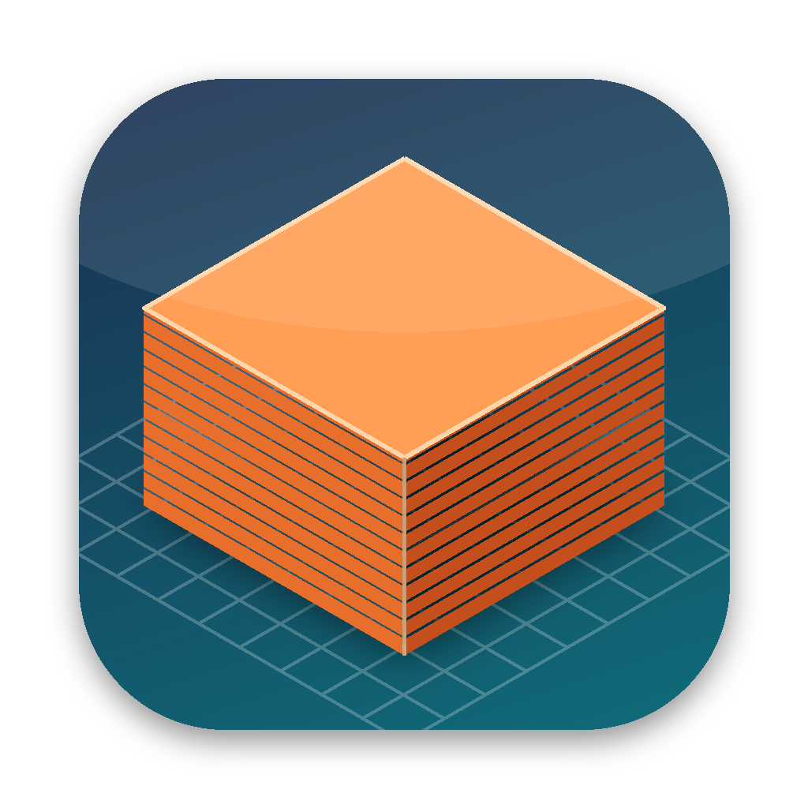
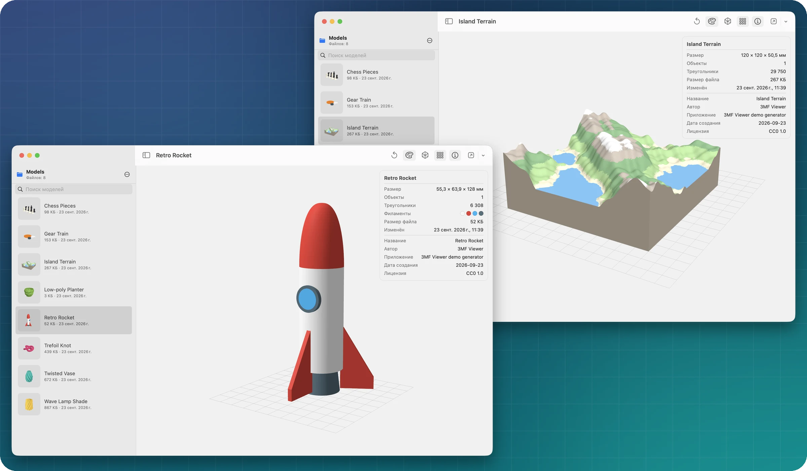
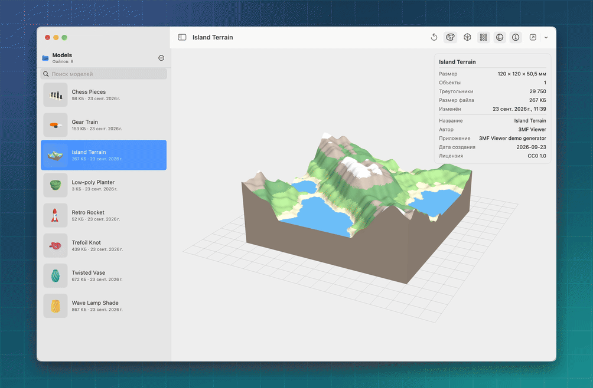
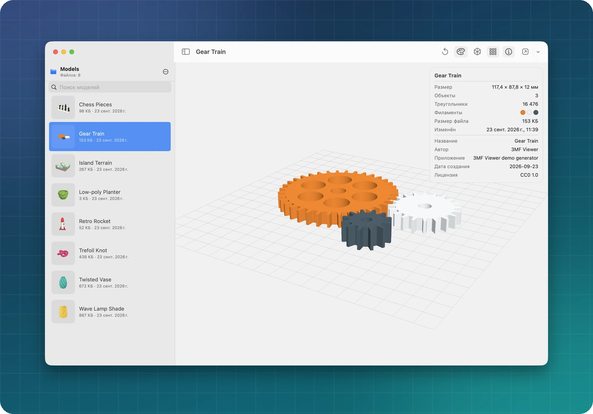
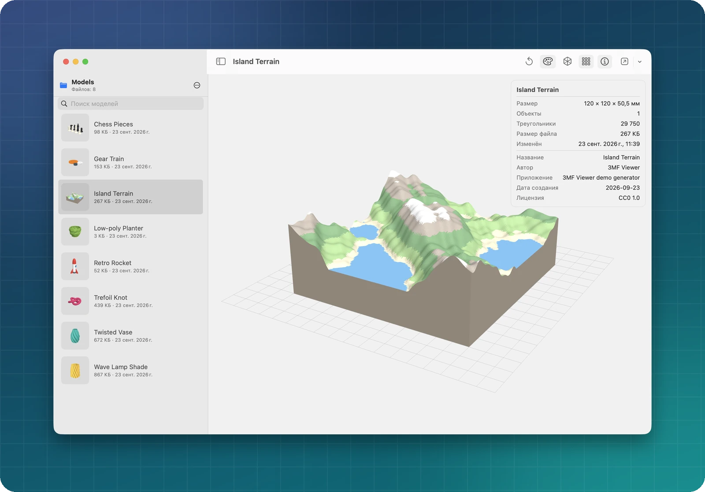
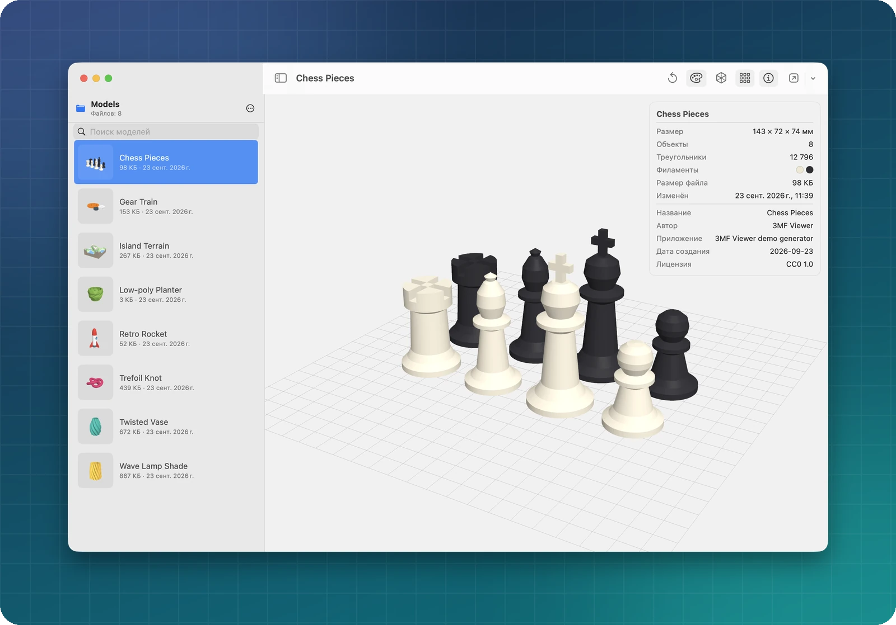
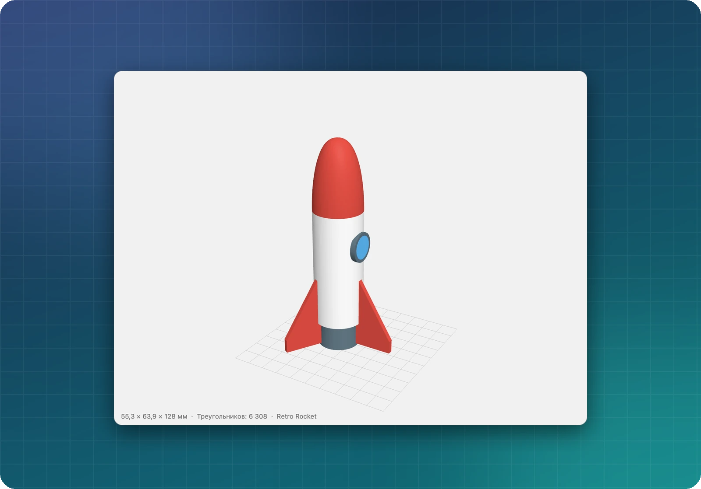
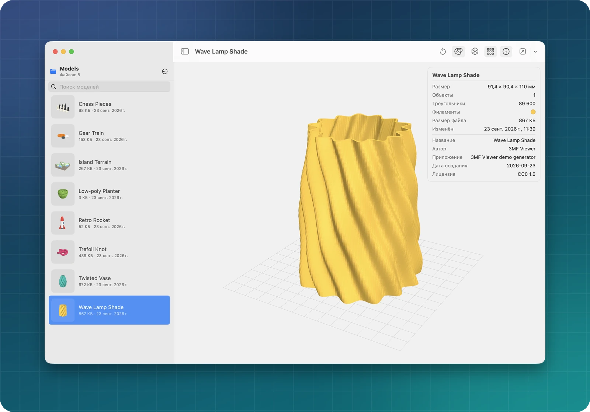
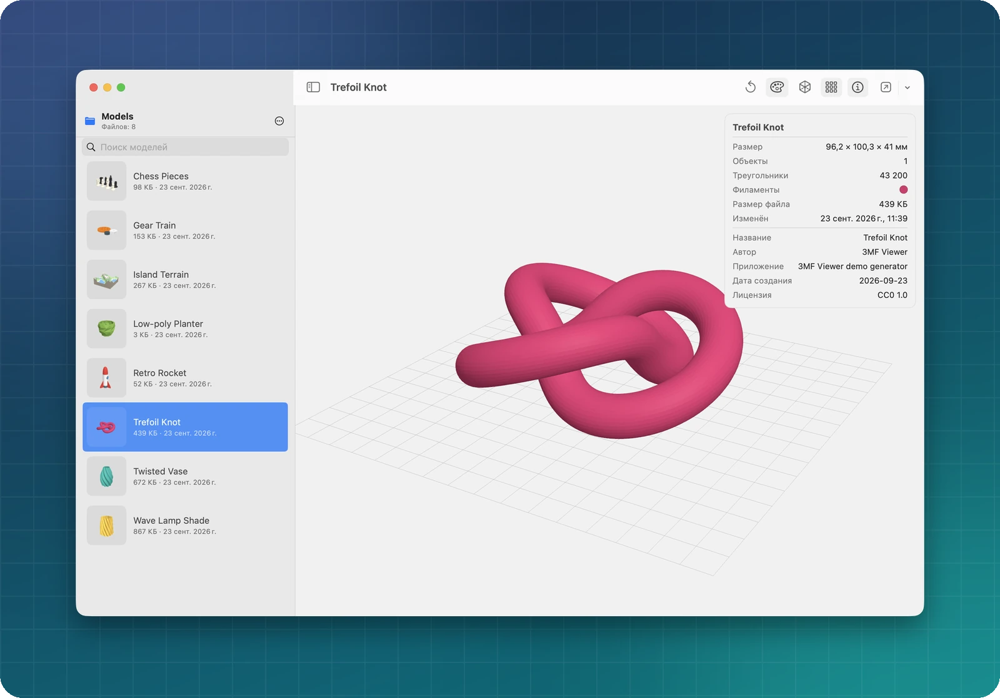

<p align="center">
  
</p>

<h1 align="center">3MF Viewer</h1>

<p align="center">
  <b>Быстрый нативный просмотрщик моделей для 3D-печати для macOS: <code>.3mf</code>, <code>.stl</code> и <code>.obj</code>.</b><br>
  Раскладывайте модели по коллекциям и категориям и листайте их: миниатюры, интерактивное 3D-превью,<br>
  настоящие цвета филаментов из Bambu Studio, OrcaSlicer и PrusaSlicer, а также Quick Look прямо в Finder.
</p>

<p align="center">
  <a href="../../releases/latest"></a>
  
  
  
  <a href="LICENSE"></a>
</p>

<p align="center"><a href="README.md">English version</a></p>

<p align="center">
  
</p>

## Зачем

Проекты из слайсера быстро копятся, а в Finder все файлы `.3mf` выглядят одинаково. Открывать каждый в слайсере, только чтобы понять, что внутри, долго. 3MF Viewer показывает всю библиотеку сразу, раскладывает её по категориям (это обычные папки на диске) и открывает даже модели из миллионов треугольников за пару секунд.

<p align="center">
  
</p>

## Возможности

- **Коллекции с категориями.** Добавьте одну или несколько папок как коллекции. Их подпапки становятся категориями и подкатегориями любой вложенности, они показаны деревом с числом моделей. Категории можно создавать, переименовывать и удалять, модели можно перетаскивать между ними или переносить через **«Переместить в»**. Все изменения делаются в самих папках, поэтому коллекция на диске всегда устроена так же, как в программе, а изменения из Finder сразу видны в программе.
- **Список или галерея.** «Все модели» или любая категория (вместе с подкатегориями) списком или галереей крупных миниатюр с ползунком размера (выделение двигается стрелками). Поиск, сортировка по имени, дате, размеру или времени печати. Файлы моделей, перетащенные из Finder на категорию, копируются в её папку.
- **STL и OBJ тоже.** Файлы STL (двоичные и текстовые) и OBJ лежат в тех же коллекциях, с миниатюрами и 3D-превью. Цвета материалов OBJ (`.mtl`) показываются, а собственный `.mtl` у OBJ переезжает вместе с ним между категориями.
- **Поиск дубликатов.** Одинаковые файлы во всех коллекциях (сравнение по содержимому, а не по имени) собираются в группы. Остаётся копия без «(2)» или «копия» в названии, остальные одним нажатием уходят в корзину.
- **Фото и описание автора.** В файлах с MakerWorld есть фотографии напечатанной модели, описание и заметки к профилю печати: они на вкладках «Фото» и «Описание».
- **Себестоимость печати.** Укажите в настройках (Себестоимость) цену килограмма PLA, PETG, ABS… и, по желанию, стоимость часа работы принтера. У нарезанных проектов в списке и в информационной панели появится примерная стоимость печати.
- **Миниатюры.** Берётся превью, которое Bambu Studio, OrcaSlicer, PrusaSlicer, Cura и другие слайсеры встраивают в файл. Если превью нет, модель рендерится в фоне. Миниатюры кэшируются на диске.
- **Интерактивное 3D-превью** (SceneKit): вращение, зум, панорамирование, сброс вида (⌘0), автовращение как на поворотном столе, каркасный режим, сетка стола.
- **Цвета из проекта слайсера**: цвета филаментов Bambu Studio / OrcaSlicer (`project_settings.config`) и PrusaSlicer (`Slic3r_PE.config`), экструдеры для объектов и частей, мультиматериальная покраска (`paint_color`, `mmu_segmentation`), цвета материалов 3MF (`basematerials`, `colorgroup`).
- **Правильная геометрия**: компоненты, production-расширение (объекты в `3D/Objects/*.model`), трансформации, единицы измерения. Модификаторы и отрицательные объёмы скрыты.
- **Столы и данные печати.** У многостоловых проектов Bambu Studio и OrcaSlicer есть выбор стола с превью из слайсера, каждый стол можно посмотреть отдельно. Для нарезанных проектов (и файлов `.gcode.3mf`) видно время печати, вес и длину филамента по цветам, принтер, сопло и высоту слоя. В списке моделей рядом с файлом показано время печати, по нему можно сортировать.
- **Информационная панель**: размеры в мм, число объектов и треугольников, филаменты, название, автор, приложение.
- **Quick Look в Finder**: нажмите пробел на файле `.3mf`, и модель можно вращать в 3D прямо в окне Quick Look. Вместо иконок файлов Finder показывает превью моделей.
- **«Открыть в программе»**: модель можно отправить в Bambu Studio, PrusaSlicer, OrcaSlicer или любое другое приложение. Есть «Показать в Finder» и «Скопировать путь».
- **Интерфейс на английском и русском.** По умолчанию английский, переключается в настройках (⌘,) или в меню программы → «Язык». Сторонних зависимостей нет.

## Скриншоты

<table>
  <tr>
    <td width="50%" valign="top">
      
      <p><b>Филаменты из проекта слайсера</b><br>
      Каждый объект получает цвет филамента, назначенный в Bambu Studio или OrcaSlicer. Образцы цветов есть в информационной панели.</p>
    </td>
    <td width="50%" valign="top">
      
      <p><b>Цвет каждого треугольника</b><br>
      Отображаются группы цветов и материалы 3MF, мультиматериальная покраска и объекты из нескольких частей.</p>
    </td>
  </tr>
  <tr>
    <td width="50%" valign="top">
      
      <p><b>Весь стол целиком</b><br>
      Все объекты стоят так же, как в слайсере. Для масштаба показана сетка стола.</p>
    </td>
    <td width="50%" valign="top">
      
      <p><b>Quick Look</b><br>
      Выделите файл в Finder и нажмите пробел: модель откроется в 3D без запуска приложения.</p>
    </td>
  </tr>
  <tr>
    <td width="50%" valign="top">
      
      <p><b>Быстро даже на тяжёлых моделях</b><br>
      Собственный побайтовый парсер 3MF загружает миллионы треугольников за секунды.</p>
    </td>
    <td width="50%" valign="top">
      
      <p><b>Вся информация о модели</b><br>
      Размеры в миллиметрах, число треугольников и объектов, автор, лицензия и программа, в которой создан файл.</p>
    </td>
  </tr>
</table>

<sub>Модели на скриншотах созданы скриптом <code>scripts/make_demo_models.py</code>.</sub>

## Требования

macOS 13 Ventura или новее, Apple Silicon или Intel.

## Установка

Скачайте `3MF-Viewer-x.y.z.zip` в разделе [Releases](../../releases), распакуйте и перенесите **3MF Viewer.app** в «Программы».

Интерфейс по умолчанию на английском. Чтобы включить русский, откройте **3MF Viewer → Language → Русский** (или настройки, ⌘,) и перезапустите приложение.

Запустите приложение один раз: так регистрируются расширения Quick Look. Если превью по пробелу не появилось, откройте «Системные настройки → Основные → Объекты входа и расширения → Quick Look» и включите **3MF Viewer**.

Приложение не нотаризовано Apple, поэтому Gatekeeper заблокирует первый запуск. Есть три способа его разрешить:

- правый клик по приложению → **Открыть**;
- «Системные настройки → Конфиденциальность и безопасность → Всё равно открыть»;
- команда в терминале:

```sh
xattr -dr com.apple.quarantine "/Applications/3MF Viewer.app"
```

### Попробовать на демо-моделях

Нет под рукой файлов `.3mf`? Сгенерируйте модели со скриншотов:

```sh
pip3 install numpy trimesh shapely
python3 scripts/make_demo_models.py ~/Desktop/3MF-Demo
```

## Сборка из исходников

Нужен Xcode 15 или новее (или Command Line Tools).

```sh
git clone https://github.com/1300023/3mf-viewer.git
cd 3mf-viewer

swift run                       # быстрый запуск из терминала
./scripts/build-app.sh          # собрать "build/3MF Viewer.app"
./scripts/build-app.sh --install    # собрать, скопировать в /Applications и подключить Quick Look
UNIVERSAL=1 ./scripts/build-app.sh --zip   # универсальный бинарник + zip для релиза
swift test                      # тесты парсера и библиотеки (нужен Xcode)
```

Чтобы работать в Xcode, откройте `Package.swift` (File → Open…) и запустите схему `ThreeMFViewer`.

## Структура проекта

```
Sources/ThreeMFKit/        разбор файлов моделей, без UI и без зависимостей
  ZipArchive.swift           минимальный ZIP/ZIP64-ридер (Apple Compression)
  XMLScanner.swift           быстрый побайтовый XML-токенизатор (миллионы вершин)
  ModelPartParser.swift      ядро 3MF + materials + production extension
  BuildFlattener.swift       элементы сборки и цепочки компонентов → размещённые меши, раскладка по столам
  SlicerConfig.swift         данные объектов Bambu Studio / OrcaSlicer / PrusaSlicer
  ProjectSettings.swift      принтер, профиль и цвета филаментов проекта слайсера
  PrintProject.swift         столы, результаты нарезки (время, филамент)
  PaintDecoder.swift         декодер мультиматериальной покраски
  MeshFileReaders.swift      STL (двоичный и текстовый) и OBJ + MTL
  ThreeMFReader.swift        публичный API: load(url:), thumbnailData(url:), printProject(url:)
  ModelExtras.swift          фото автора (Auxiliaries/) и описание (HTML → текст)
Sources/ThreeMFLibrary/    коллекции на диске, без UI: сканер, операции с файлами, фильтр и сортировка, дубликаты, себестоимость,
                           настройки, слежение за папками (FSEvents)
Sources/ThreeMFRendering/  сцена SceneKit, офскрин-рендер, форматирование данных печати (общее с Quick Look)
Sources/ThreeMFViewer/     приложение на SwiftUI
  Library/                   LibraryModel (состояние окна), кэш миниатюр
  Views/Library/             панель коллекций, список и галерея моделей, меню
  Views/Detail/              3D-вид, информационная панель, выбор стола
  Views/Common/              мелкие общие компоненты
Sources/Extensions/        расширения Quick Look: превью (пробел) и миниатюры (иконки в Finder)
Packaging/                 Info.plist, entitlements, иконка и локализации для бандлов
scripts/                   build-app.sh, генераторы демо-моделей, скриншотов, иконки и тестовых файлов
docs/screenshots/          картинки для README
Tests/ThreeMFKitTests/     тесты парсера с маленькими файлами .3mf / .stl / .obj
Tests/ThreeMFLibraryTests/ тесты библиотеки на временных папках
```

## Выпуск релиза

Запушьте тег вида `v1.0.0`. Workflow GitHub Actions прогонит тесты, соберёт универсальное `.app`, упакует его в zip и прикрепит к GitHub Release.

Для подписанной и нотаризованной сборки задайте `SIGN_IDENTITY="Developer ID Application: …"` при запуске `build-app.sh` и нотаризуйте zip через `xcrun notarytool`.

## Идеи на будущее

- Теги и избранное
- Файлы STEP

## Лицензия

[MIT](LICENSE)
